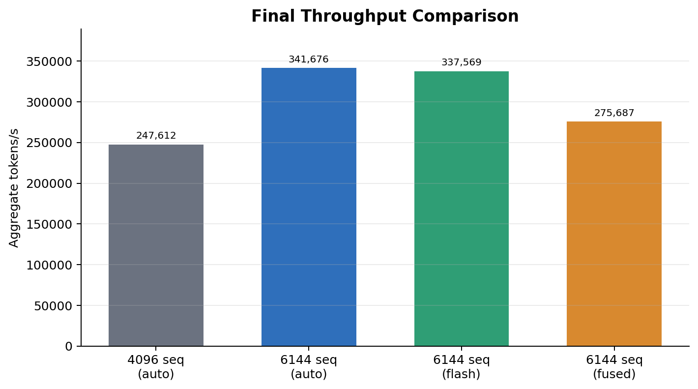
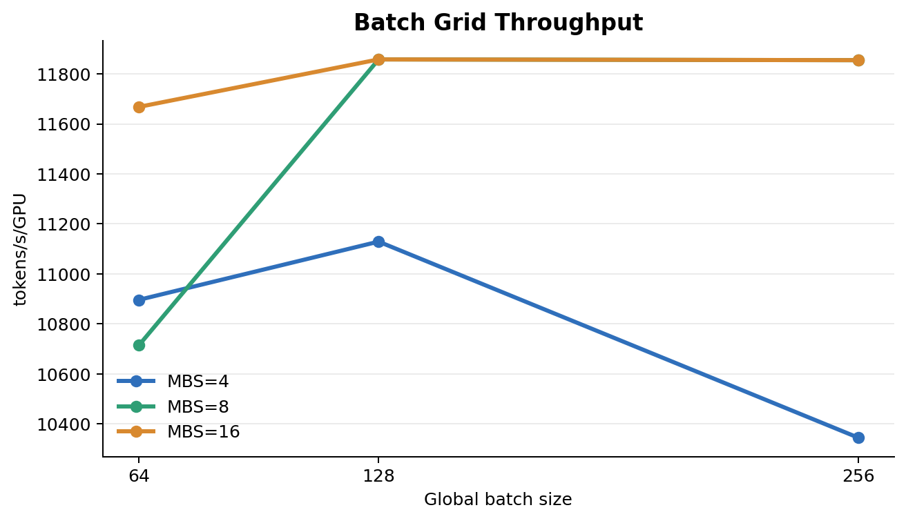
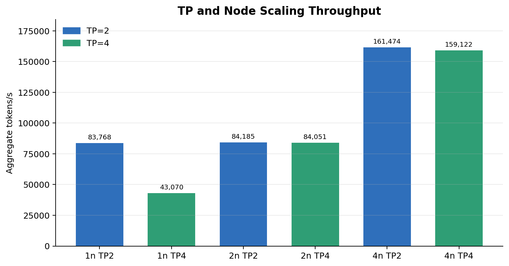
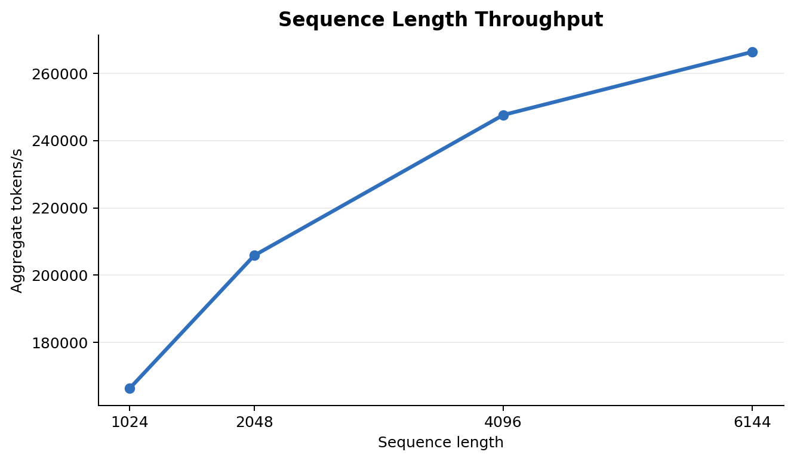
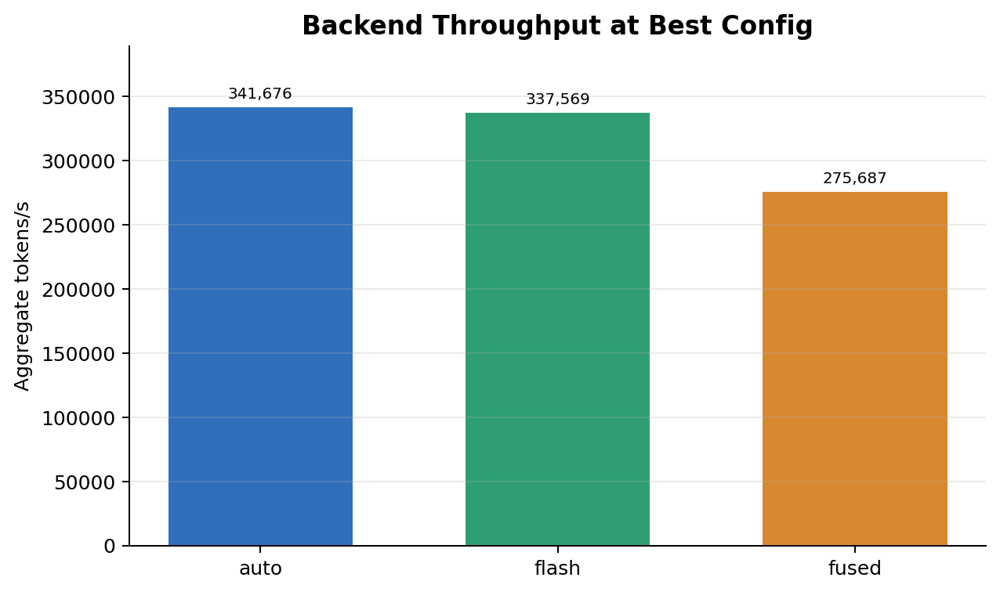

# Final Benchmark Report

This report merges Giulio's throughput, memory, TP/node scaling,
sequence-length, and backend sweeps for the `8b` benchmark track. Failed runs
are excluded from completed-performance comparisons and called out separately.

## Best Configuration

The best measured configuration is:

| Control | Best value |
|---|---:|
| Model | 8b |
| Nodes | 4 |
| GPUs per node | 4 |
| Total GPUs | 16 |
| Tensor parallelism | 2 |
| Pipeline parallelism | 1 |
| Transformer implementation | transformer_engine |
| Attention backend | auto |
| Sequence length | 6144 |
| Micro batch size | 8 |
| Global batch size | 64 |
| Steps | 100 |

Run command:

```bash
MODEL_SIZE=8b NODES=4 GPUS_PER_NODE=4 TP=2 MBS=8 GBS=64 SEQ_LEN=6144 BACKENDS=auto bash benchmark_backend_best_tp.sh
```

Best observed result:

| Metric | Value |
|---|---:|
| Avg tokens/s/GPU | 21,355 |
| Aggregate tokens/s | 341,676 |
| Avg iter time | 1,166.7 ms |
| Avg TFLOP/s/GPU | 237.1 |
| Peak allocated memory | 81.4 GB |
| Peak reserved memory | 85.6 GB |



The final choice is `NODES=4`, `TP=2`, `MBS=8`, `GBS=64`, `SEQ_LEN=6144`, and
`ATTENTION_BACKEND=auto`. This is the best completed combination after applying
the best result from each control sweep.

## Control 1: MBS and GBS

Setup for this control:

| Setting | Value |
|---|---:|
| Model | 8b |
| Backend | auto |
| Sequence length | 4096 |
| Nodes | 1 |
| GPUs per node | 4 |
| TP | 4 |
| PP | 1 |
| Steps | 100 |

Benchmark table:

| MBS | GBS | Last iter | Avg tok/s/GPU | Avg iter ms | Peak allocated GB | Peak reserved GB | Last loss |
|---:|---:|---:|---:|---:|---:|---:|---:|
| 4 | 64 | 100 | 10,896 | 6,085.2 | 22.7 | 23.5 | 6.4769 |
| 4 | 128 | 100 | 11,129 | 11,848.4 | 22.7 | 23.5 | 6.2519 |
| 4 | 256 | 68 | 10,345 | 25,966.4 | 22.7 | 23.5 | 6.6787 |
| 8 | 64 | 100 | 10,714 | 6,123.7 | 40.3 | 41.8 | 6.4631 |
| 8 | 128 | 100 | 11,858 | 11,100.7 | 40.3 | 41.8 | 6.2111 |
| 8 | 256 | 78 | 11,855 | 22,221.4 | 40.3 | 41.8 | 6.4743 |
| 16 | 64 | 100 | 11,668 | 5,734.8 | 75.7 | 78.4 | 6.4609 |
| 16 | 128 | 100 | 11,858 | 11,100.6 | 75.7 | 78.4 | 6.2063 |
| 16 | 256 | 78 | 11,855 | 22,221.4 | 75.7 | 78.4 | 6.5715 |



Finding: `MBS` controls memory. `GBS` changes gradient accumulation work, but it
does not materially change peak memory. `MBS=8` is the practical winner because
it reaches the best observed throughput while using far less memory than
`MBS=16`. `GBS=64` is kept for the final configuration because the later
TP/node, sequence-length, and backend sweeps all used `GBS=64`.

## Control 2: TP and Node Count

Setup for this control:

| Setting | Value |
|---|---:|
| Model | 8b |
| Backend | auto |
| MBS | 8 |
| GBS | 64 |
| Sequence length | 4096 |
| GPUs per node | 4 |
| PP | 1 |
| Steps | 100 |

Benchmark table:

| Nodes | GPUs | TP | Last iter | Avg tok/s/GPU | Aggregate tok/s | Avg iter ms | Avg TFLOP/s/GPU | Peak alloc GB | Last loss |
|---:|---:|---:|---:|---:|---:|---:|---:|---:|---:|
| 1 | 4 | 2 | 100 | 20,942 | 83,768 | 3,192.9 | 212.7 | 58.0 | 6.4294 |
| 1 | 4 | 4 | 100 | 10,768 | 43,070 | 6,303.1 | 109.4 | 40.3 | 6.4767 |
| 2 | 8 | 2 | 100 | 10,523 | 84,185 | 3,192.9 | 106.9 | 56.2 | 6.5178 |
| 2 | 8 | 4 | 100 | 10,506 | 84,051 | 3,192.9 | 106.7 | 38.6 | 6.4478 |
| 4 | 16 | 2 | 100 | 10,092 | 161,474 | 1,749.8 | 102.5 | 55.4 | 6.5254 |
| 4 | 16 | 4 | 100 | 9,945 | 159,122 | 1,750.6 | 101.0 | 37.8 | 6.4202 |



Finding: the best completed TP/node setting is `NODES=4`, `TP=2`. `TP=4` saves
about 17-18 GB per GPU at four nodes, but it is slightly slower. Use `TP=4` only
when memory headroom is more important than maximum throughput.

## Control 3: Sequence Length

Setup for this control:

| Setting | Value |
|---|---:|
| Model | 8b |
| Backend | auto |
| Nodes | 4 |
| GPUs per node | 4 |
| Total GPUs | 16 |
| TP | 2 |
| PP | 1 |
| MBS | 8 |
| GBS | 64 |
| Steps | 100 |

Benchmark table:

| Seq len | Last iter | Avg tok/s/GPU | Median tok/s/GPU | Aggregate tok/s | Avg iter ms | Avg TFLOP/s/GPU | Peak alloc GB | Last loss |
|---:|---:|---:|---:|---:|---:|---:|---:|---:|
| 1024 | 100 | 10,397 | 9,830 | 166,352 | 444.4 | 90.9 | 16.9 | 6.1906 |
| 2048 | 100 | 12,865 | 12,326 | 205,839 | 682.5 | 118.5 | 29.6 | 6.2158 |
| 4096 | 100 | 15,476 | 14,949 | 247,612 | 1,117.7 | 157.2 | 55.4 | 6.5399 |
| 6144 | 100 | 16,647 | 16,104 | 266,360 | 1,526.0 | 184.8 | 81.4 | 6.0597 |



Finding: longer sequence lengths improve hardware utilization across the tested
range. `SEQ_LEN=6144` is the best completed sequence-length value, but it is
close to the memory limit at `MBS=8`. `SEQ_LEN=4096` is the safer fallback.

## Control 4: Attention Backend

Setup for this control:

| Setting | Value |
|---|---:|
| Model | 8b |
| Nodes | 4 |
| GPUs per node | 4 |
| Total GPUs | 16 |
| TP | 2 |
| PP | 1 |
| MBS | 8 |
| GBS | 64 |
| Sequence length | 6144 |
| Transformer implementation | transformer_engine |
| Steps | 100 |

Benchmark table:

| Backend | Runs | Avg tok/s/GPU | Median tok/s/GPU | Aggregate tok/s | Avg iter ms | TFLOP/s/GPU | Peak alloc GB | Peak reserved GB | Diff vs auto |
|---|---:|---:|---:|---:|---:|---:|---:|---:|---:|
| auto | 2 | 21,355 | 21,408 | 341,676 | 1,166.7 | 237.1 | 81.4 | 85.6 | baseline |
| flash | 2 | 21,098 | 21,290 | 337,569 | 1,168.0 | 234.2 | 84.9 | 89.3 | -1.2% |
| fused | 1 | 17,230 | 17,273 | 275,687 | 1,475.1 | 191.3 | 81.4 | 85.6 | -19.3% |



Finding: `ATTENTION_BACKEND=auto` is the best backend. `flash` is close but
slightly slower and uses more memory. `fused` is much slower. `unfused` OOMed at
`SEQ_LEN=6144`, `MBS=8`, so it is not viable for the final configuration.
`local` was not a valid comparable run because the GPT local-spec path is not
wired correctly in this repo.

## Final Recommendations

Use this for maximum measured throughput:

```bash
MODEL_SIZE=8b NODES=4 GPUS_PER_NODE=4 TP=2 MBS=8 GBS=64 SEQ_LEN=6144 BACKENDS=auto bash benchmark_backend_best_tp.sh
```

Use this for more memory headroom:

```bash
MODEL_SIZE=8b NODES=4 GPUS_PER_NODE=4 TP=2 MBS=8 GBS=64 SEQ_LEN=4096 BACKENDS=auto bash benchmark_backend_best_tp.sh
```

Use this when memory is the hard constraint:

```bash
MODEL_SIZE=8b NODES=4 GPUS_PER_NODE=4 TP=4 MBS=8 GBS=64 SEQ_LEN=4096 BACKENDS=auto bash benchmark_backend_best_tp.sh
```

Keep `GBS=64` in the final configuration. It is the value used in the TP/node,
sequence-length, and backend sweeps, so the final recommendation is based on
directly measured runs rather than mixing settings from different experiments.
